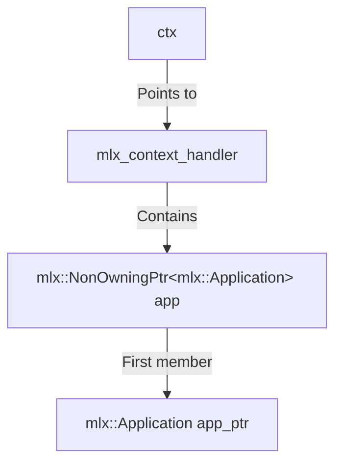

# The Idea

The idea is simple: to be able to use an another graphics lib in MacroLibX, you need pointers to VkInstance, VkDevice and VkPhysicalDevice. (at least for imgui). MacroLibX does not allow you to obtain these pointers directly. So the way i used is to retrieve them with an offset from mlx_context.

## Why?
idk
## Proof of concept (yes, literally)
```cpp
mlx::Application* app_ptr = __internal_application_ptr;
mlx::RenderCore& renderCore = mlx::RenderCore::Get();

ptrdiff_t base_offset = reinterpret_cast<char*>(&renderCore) - reinterpret_cast<char*>(app_ptr);

VkInstance& instanceRef = renderCore.GetInstanceRef();
ptrdiff_t instance_offset = reinterpret_cast<char*>(&instanceRef) - reinterpret_cast<char*>(&renderCore);

VkDevice& deviceRef = renderCore.GetDeviceRef();
ptrdiff_t device_offset = reinterpret_cast<char*>(&deviceRef) - reinterpret_cast<char*>(&renderCore);

VkPhysicalDevice& physDeviceRef = renderCore.GetPhysicalDeviceRef();
ptrdiff_t phys_device_offset = reinterpret_cast<char*>(&physDeviceRef) - reinterpret_cast<char*>(&renderCore);
```
Here's the code used to retrieve the offsets, base_offset, which corresponds to the address of 
```cpp
mlx::RenderCore::Get()
```
from the  `mlx_context`

GetPhysicalDeviceRef and GetDeviceRef don't exist by default, so you need to create them and put them in the `RenderCore.h` file
```cpp
[[nodiscard]] MLX_FORCEINLINE VkDevice& GetDeviceRef() noexcept { return m_device; }
[[nodiscard]] MLX_FORCEINLINE VkPhysicalDevice& GetPhysicalDeviceRef() noexcept { return m_physical_device; }
```
Giving the following output
```
BASE OFFSET: 0x19F5B0
Offset from RenderCore base to instance: 0x350
Offset from RenderCore base to device: 0x358
Offset from RenderCore base to physical device: 0x360
```
## And now, what?
In C, with the 42 norm, it is necessary to be able to retrieve the values USING THE NORM.
```c
# define BASE_OFFSET 0x19F5B0
# define INSTANCE_OFFSET 0x350
# define DEVICE_OFFSET 0x358
# define PHYSICAL_DEVICE_OFFSET 0x360
```
```c
void	*mlx_get_app_ptr(void *ctx)
{
	void	*app_ptr;

	app_ptr = *(void **)ctx;
	return (app_ptr);
}
```
### Why de-referencing *(void **)ctx;

The mlx_context_handler struct
```c
struct  mlx_context_handler
{
	mlx::NonOwningPtr<mlx::Application>  app;
};
```


Dereferencing `*(void **)ctx` allows direct access to the Application pointer stored as the first member of the structure.
### The wrapper
```c
void	*mlx_get_instance(void *ctx)
{
	void		*app_ptr;
	VkInstance	*instance_ptr;

	app_ptr = mlx_get_app_ptr(ctx);
	if (!app_ptr)
		return (NULL);
	instance_ptr = (VkInstance *)((unsigned char *)app_ptr
		+ BASE_OFFSET + INSTANCE_OFFSET);
	return (*instance_ptr);
}

void	*mlx_get_device(void *ctx)
{
	void		*app_ptr;
	VkDevice	*device_ptr;

	app_ptr = mlx_get_app_ptr(ctx);
	if (!app_ptr)
		return (NULL);
	device_ptr = (VkDevice *)((unsigned char *)app_ptr
		+ BASE_OFFSET + DEVICE_OFFSET);
	return (*device_ptr);
}

void	*mlx_get_physical_device(void *ctx)
{
	void				*app_ptr;
	VkPhysicalDevice	*phys_device_ptr;

	app_ptr = mlx_get_app_ptr(ctx);
	if (!app_ptr)
		return (NULL);
	phys_device_ptr = (VkPhysicalDevice *)((unsigned char *)app_ptr
		+ BASE_OFFSET + PHYSICAL_DEVICE_OFFSET);
	return (*phys_device_ptr);
}
```
```
app_ptr + BASE_OFFSET will give the RenderCore instance
app_ptr + BASE_OFFSET + INSTANCE_OFFSET will give the m_instance member.
```
Using `(unsigned char *)` is adding exact byte offsets. This `(VkInstance *)` is the final cast returns the resulting pointer to the correct type.
